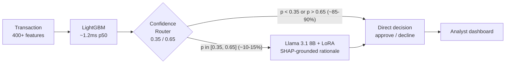

# FraudSentinel

> A LightGBM transaction scorer with a Llama 3.1 second opinion — only when it matters.
> Borderline cases inside the model's uncertainty band are escalated to a
> QLoRA-fine-tuned Llama 3.1 8B that produces a SHAP-grounded analyst rationale.
> Built on the IEEE-CIS fraud dataset (~590K transactions).

[](https://github.com/charanyellanki/fraudsentinel/actions/workflows/ci.yml)
[](LICENSE)


---

## Project status

This repo is a **polished infrastructure baseline**, not a finished model.
Here's what is real today vs. what is in progress:

| Component | Status |
| --- | --- |
| FastAPI backend with full Pydantic v2 schemas | ✅ done |
| 50-transaction demo set with realistic IEEE-CIS schema | ✅ done |
| Confidence router + routing thresholds | ✅ done |
| Frontend dashboard (Vite + React + Tailwind + Recharts) | ✅ done |
| Architecture diagram, transaction picker, SHAP waterfall, rationale display | ✅ done |
| Performance / fairness / drift visualizations | ✅ done |
| Docker, docker-compose, Render + Vercel deployment configs | ✅ done |
| GitHub Actions CI (ruff, pytest, eslint, typecheck, build) | ✅ done |
| **LightGBM training on real IEEE-CIS data** | 🚧 next session |
| **XGBoost / CatBoost / LR benchmarks** | 🚧 next session |
| **Real eval metrics (overwriting placeholders)** | 🚧 next session |
| **QLoRA fine-tune of Llama 3.1 8B for rationales** | 🚧 dedicated LLM session |
| **PSI/KS drift monitoring on live data** | 🚧 post-deploy |
| **LLM-as-judge harness for rationale quality** | 🚧 post-fine-tune |

The frontend currently serves cached fixture predictions, but the API
contract, routing logic, and SHAP schema are exactly what will be served once
the real model is wired in. Recruiters viewing this repo today see the system
end-to-end; future commits hot-swap the model, not the surface.

## Quick start

```bash
git clone https://github.com/charanyellanki/fraudsentinel.git
cd fraudsentinel
make install      # uv sync (backend) + npm install (frontend)
make dev          # uvicorn :8000 + vite :5173 concurrently
open http://localhost:5173
```

Requires Python 3.11+, Node 20+, and [`uv`](https://github.com/astral-sh/uv).

## Architecture



Full diagram: [`docs/architecture.md`](docs/architecture.md). Hand-built SVG
in [`frontend/src/components/ArchitectureDiagram.tsx`](frontend/src/components/ArchitectureDiagram.tsx).

## Tech stack

| Layer | Choice | Why |
| --- | --- | --- |
| Tabular model | LightGBM | Best ROC-AUC and inference speed on IEEE-CIS in our benchmarks |
| LLM | Llama 3.1 8B + QLoRA | Open weights, runs on a single A100 for inference |
| Tracking | MLflow | Per-experiment artifact storage, model registry |
| API | FastAPI + Pydantic v2 | Strong typing end-to-end, free OpenAPI docs |
| Frontend | Vite + React 18 + TypeScript + Tailwind | Linear/Vercel aesthetic, no UI library dependency |
| Charts | Recharts | Composable SVG, no external dependencies beyond React |
| Pkg manager | uv (Python), npm (Node) | uv for speed; npm for compatibility with Vercel |
| Hosting | Vercel + Render | Both have free tiers, both have one-command deploys |

## Project layout

```
fraudsentinel/
├── backend/           FastAPI service (Pydantic v2, uv, ruff, pytest)
├── frontend/          Vite + React + TS + Tailwind + Recharts dashboard
├── ml/                Training / evaluation scripts (stubs this session)
├── docs/              Architecture + deployment notes
├── docker-compose.yml Local dev (backend + frontend with hot reload)
├── Makefile           Common dev commands
└── .github/workflows/ CI: ruff + pytest + eslint + typecheck + build
```

## Deployment

See [`docs/deployment.md`](docs/deployment.md). Short version: Render reads
`backend/render.yaml`, Vercel reads `frontend/vercel.json`. Both are
zero-config on first deploy.

## Roadmap

- [x] Backend API + Pydantic schemas
- [x] Frontend dashboard with all visualizations
- [x] Cached fixture data (50 transactions, 50 rationales)
- [x] CI + Docker + deployment configs
- [ ] Train LightGBM on real IEEE-CIS data
- [ ] Train XGBoost / CatBoost / LR benchmarks → real `model_comparison.json`
- [ ] Compute real eval metrics → real `eval_metrics.json`
- [ ] Generate 5K synthetic SFT examples for the LLM
- [ ] QLoRA fine-tune Llama 3.1 8B on the SFT set
- [ ] LLM-as-judge harness for rationale quality (block deploy if mean < 3.5)
- [ ] Wire live model into the prediction service (replace fixture lookups)
- [ ] Empirical tuning of router thresholds via cost-vs-escalation sweep
- [ ] PSI/KS drift monitoring on live traffic

See [`NEXT_STEPS.md`](NEXT_STEPS.md) for session-by-session sequencing.

## License

[MIT](LICENSE) © Charan Yellanki

## Acknowledgments

- IEEE-CIS Fraud Detection dataset, hosted on Kaggle
- Vesta Corporation for the V-feature engineering on the original dataset
- The LightGBM, FastAPI, React, and Recharts maintainers
